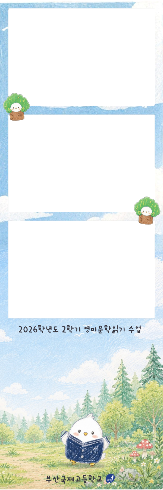
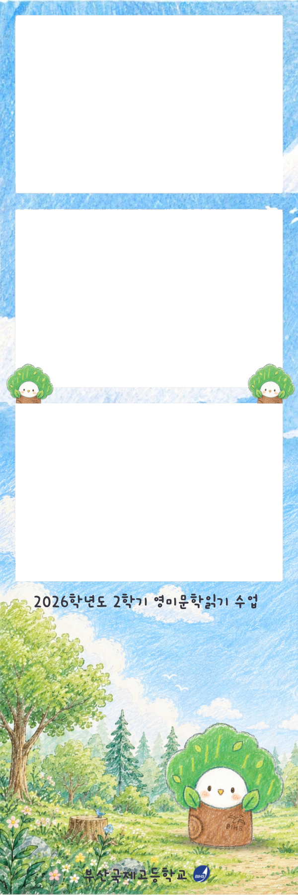

<title>영미문학읽기 포토부스</title>
<link rel="preconnect" href="https://fonts.googleapis.com">
<link rel="preconnect" href="https://fonts.gstatic.com" crossorigin>
<link rel="stylesheet" href="https://fonts.googleapis.com/css2?family=Gaegu:wght@400;700&family=Gowun+Dodum&display=swap">

  <header>
    
부산국제고등학교 · BIHS

    <h1>영미문학읽기 포토부스2026학년도 2학기 · English &amp; American Literature</h1>
  </header>

  

    

      

        <canvas id="preview" width="600" height="1800" aria-label="포토 프레임 미리보기"></canvas>
        <button class="slot" data-i="0" aria-label="1번 컷 선택"></button>
        <button class="slot" data-i="1" aria-label="2번 컷 선택"></button>
        <button class="slot" data-i="2" aria-label="3번 컷 선택"></button>
      

      
칸을 누르면 그 컷만 다시 찍을 수 있어요

    

    

      <section class="panel">
        <h2 class="label">프레임 고르기</h2>
        

          <button class="frame-opt" id="opt-forest" data-frame="forest" aria-pressed="true">
            
            숲길 친구
          </button>
          <button class="frame-opt" id="opt-tree" data-frame="tree" aria-pressed="false">
            
            나무 친구
          </button>
        

      </section>

      <section class="panel controls-panel">
        <h2 class="label">세 컷 채우기</h2>
        
세 컷을 찍거나 앨범에서 고르면 프레임에 바로 들어가요. 사진은 서버로 보내지 않고 이 휴대폰 안에서만 만들어져요.

        

        

        <button class="text-btn" id="reset">처음부터 다시 하기</button>
      </section>
    

  

<input type="file" id="cam" accept="image/*" capture="user" hidden>
<input type="file" id="album" accept="image/*" multiple hidden>

  

    <h2 id="sheet-title">완성!</h2>
    
    
<b>사진을 길게 눌러</b> ‘사진에 저장’(아이폰) 또는 ‘이미지 다운로드’(안드로이드)를 선택하세요.

    

      <button class="btn" id="close">닫고 고치기</button>
      <button class="btn navy" id="again">새로 찍기</button>
    

  

사진 넣는 중…

